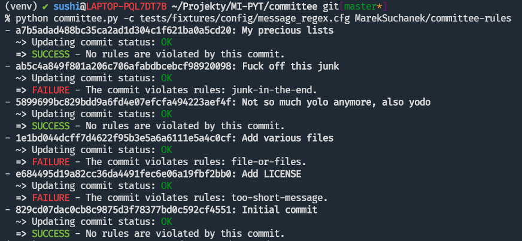
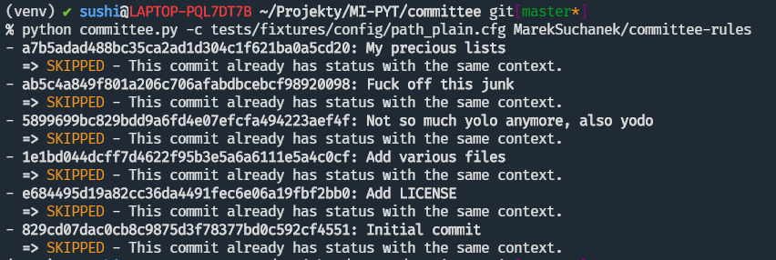
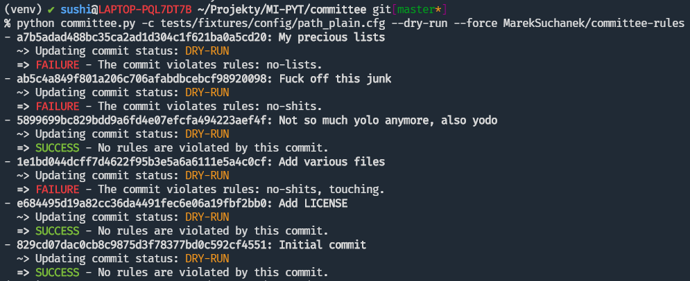
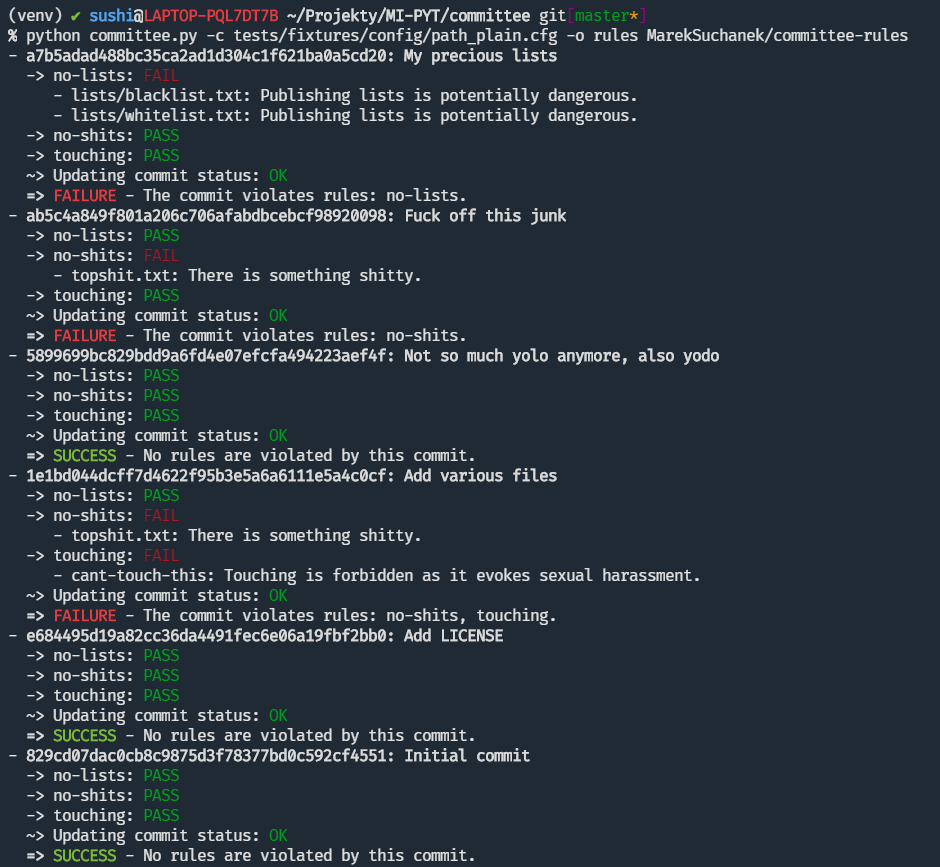
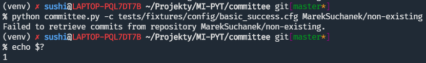
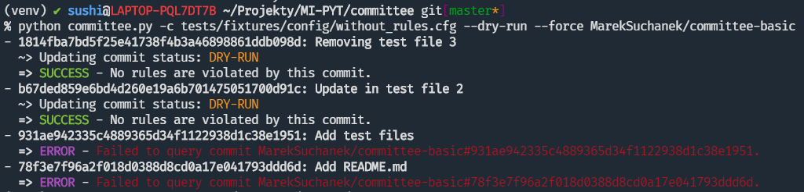

= Committee I.
:toc:
:note-caption: :information_source:
:warning-caption: :warning:

== Zadání úkolu

Vaším úkolem za 5 bodů je vytvořit command line aplikaci pracující s GitHub API,
pomocí knihoven http://docs.python-requests.org[requests] a
http://click.pocoo.org[click].

Aplikace slouží ke kontrole commitů na GitHub podle nastavených pravidel.
Například: pokud commit message obsahuje zvolená (nevhodná) slova, tak je označen
jako chybný; podobně například pokud commit obsahuje příliš mnoho změn, nebo
odstraňuje důležitý souboru jako je třeba README nebo LICENSE.

== Konfigurace

Aplikace používá konfigurační soubor napsané ve formátu pro
https://docs.python.org/3/library/configparser.html[configparser].
Obsahuje jak token pro komunikaci s GitHub API, tak i nastavení pravidel pro
kontrolu commitů.

committee.cfg
[source,ini]
----
[github]
token=xxxxxxxxxxxxxxxxxxxxx

[committee]
context=My/Committee

[rule:polite-message]
text=Commit message contains dirty words.
type=message
match=wordlist:/my/wordlists/dirty.txt

[rule:keep-license]
text=LICENSE should not be removed.
type=path
status=removed
match=plain:LICENSE

[rule:no-dummy-files]
text=Some dummy file is added.
type=path
status=added
match=regex:.*dummy.*

[rule:atomic-commits]
text=The commits is way too big.
type=stats
scope=commit
stat=total
max=5000
----

- `github.token` (povinný) = token pro veškerou komunikaci s GitHub API
- `committee.context` (povinný) = kontext pro nastavení Commit Status

== Pravidla pro kontrolu commitů

Pravidla se v konfiguračním souboru definují jako jednotlivé sekce, jejichž
název je ve formátu `rule:<název-pravidla>` (například pravidlo v sekci
`rule:keep-license` má název `keep-license`). Každé pravidlo pak obsahuje
atributy:

* `text` (povinný) = text popisující porušení pravidla
* `type` (povinný) = určení typu pravidla, jedna z hodnot: `message`,
  `path`, `stats`

Další atributy jsou dle typu pravidla. Dále aplikace s pravidly pracuje v
abecedním pořadí.

=== Pravidlo `message`

Pravidlo je aktivní (značí porušení), pokud najde shodu v commit message.

* `match` (povinný) = nastavení hledání shody
** `plain:<word>` = vyhledává v commit message zadané slovo jako substring
** `regex:<pattern>` = shoda s regulárním výrazem (hint: modul
   https://docs.python.org/3/library/re.html[re])
** `wordlist:<file>` = vyhledává slova z wordlistu, kde slovo=řádka, shodně jako je to pro `plain` (cesta je
   absolutní nebo relativní od konfiguračního souboru)

Hledání shody je pro `plain`, `regex` i `wordlist` vždy case insensitive.

=== Pravidlo `path`

Pravidlo je aktivní (značí porušení), pokud najde shodu v cestách souborů
změněných v rámci commitu.

* `status` (nepovinný) = stav souboru: `modified`, `added`, `removed`, `*`
  (výchozí, =jakýkoliv stav)
* `match` (povinný) = nastavení hledání shody (jako pro `message`, akorát
  vyhledává v názvu souboru)

=== Pravidlo `stats`

Pravidlo je aktivní (značí porušení), pokud daná statistika commitu nebo souboru
je mimo stanovené meze.

* `scope` (nepovinný) = určení zda pracuje se statistikami celého commitu
  nebo na úrovni jednotlivých souborů, hodnota `commit` (výchozí) nebo `file`
* `stat` (povinný) = jaká statistika je využívá
** pro `scope=commit` jedna z hodnot: `total`, `additions`, `deletions`
** pro `scope=file` jedna z hodnot: `changes`, `additions`, `deletions`
* `min` (*) = minimální povolená hodnota (výchozí 0)
* `max` (*) = maximální povolená hodnota

(*) je povinný alespoň jeden z atributů `min` a `max`

(Poznámka: Pokud `min=max=100`, pak pouze hodnota `100` je "v pořádku".)

== Rozhraní pro příkazovou řádku

Soubor ke spuštění pojmenujte `committee.py`.

Při jeho spuštění s příkazem `--help` očekáváme nápovědu:

[source]
----
$ python committee.py --help
Usage: committee.py [OPTIONS] REPOSLUG

Options:
  --version                       Show the version and exit.
  -c, --config FILENAME           Committee configuration file.
  -a, --author AUTHOR             GitHub login or email address of author for
                                  checking commits.

  -p, --path PATH                 Only commits containing this file path will
                                  be checked.

  -r, --ref REF                   SHA or branch to check commits from (default
                                  is the default branch).

  -f, --force                     Check even if commit has already status with
                                  the same context.

  -o, --output-format [none|commits|rules]
                                  Verbosity level of the output.  [default:
                                  commits]

  -d, --dry-run                   No changes will be made on GitHub.
  --help                          Show this message and exit.
----

Argument určující repozitář, pro který se budou commity kontrolovat, se očekává
ve formátu „reposlug“ (`uživatel/název` případně `organizace/název`). Aplikace
https://docs.github.com/en/rest/reference/repos#list-commits[projde všechny commity]
(vyhovující filtrům author, path, ref) v tomto repozitáři a
https://docs.github.com/en/rest/reference/repos#create-a-commit-status[nastaví status]
dle výsledku kontroly (viz dále).

(Poznámka: Vše co se očekává od `--help` lze snadno nastavit pomocí knihovny click.)

=== Přepínače

`-c, --config FILENAME`::
  Cesta ke konfiguračnímu souboru popsanému výše.

`-a, --author AUTHOR`::
  Filtrování commitů na základě jejich autora (v souladu s GitHub API).

`-p, --path PATH`::
  Filtrování commitů na základě cesty souboru (v souladu s GitHub API).

`-r, --ref REF`::
  Filtrování commitů na základě SHA nebo jména větve (v souladu s GitHub API).

`-f, --force`::
  Přepínač (flag) pro povolení přepisování commit status na GitHub. Bez tohoto přepínače
  se commity, kde je již nastaven status se shodným `context` přeskakují.

`-o, --output-format [none|commits|rules]`::
  Nastavení formátu výstupu, jedna z hodnot `none`, `commits` (výchozí) a `rules`. Vždy
  značí "co se vypisuje": `none` = nevypisuje se nic, `commits` = vypisují se commity a
  jejich výsledky, `rules` = vypisují se commity včetně jednotlivých pravidel a dílčích
  výsledků.

`-d, --dry-run`::
  Přepínač (flag) pro běh "nanečisto" = nejsou prováděny žádné změny na GitHubu, tzn.
  nastavování commit status je přeskakováno. To je jediná změna a ve výstupu se projeví
  pouze v informaci o aktualizaci commit status (viz dále)

`--version`::
  Běžný přepínač pro zjištění verze (click).

`--help`::
  Běžný přepínač pro nápovědu (click).

=== Nastavení Commit Status

Pro každý commit získaný pro zadaný repozitář (dle případně nastavených filtrů `author`,
`path`, `ref`) aplikace nastaví podle kontroly pravidel odpovídající
https://docs.github.com/en/rest/reference/repos#statuses[Commit Status]:

* `success` s popisem "No rules are violated by this commit."
* `failure` s popisem "The commit violates rules: X, Y, Z." (kde `X`, `Y`, `Z` jsou seřazené názvy
  porušených pravidel tímto commitem)

V obou případech se nastavuje `context` z konfiguračního souboru.

V případě, že není použit přepínač `-f/--force` a současně již má commit status se shodným
`context`, pak se kontrola zcela přeskakuje. Pokud však `-f/--force` je použit, nový commit
status přepíše původní existuje-li. K tomuto přepsání stačí poslat POST request dle API
dokumentace (shodný `context` určí, že dojde k přepsání = nelze mít více commit status se
stejným `context` u jednoho commitu).

=== Výstup

Výstup se liší dle nastavení přepínače `-o, --output-format`.

Pokud je přepínač nastaven na hodnotu `none`, aplikace nevypisuje nic s výjimkou fatálních chyb
vypisovaných na standardní chybový výstup a následovaných ukončením aplikace (viz dále) včetně
chyb způsobených chybějícími povinnými argumenty a přepínači.

V případě hodnoty `commits` se vypisují jednotlivé commity v pořadí, v jakém přijdou z API
ve formátu:

[source]
----
- <SHA>: <MESSAGE>
  ~> <COMMIT STATUS CHANGE>
  => <RESULT FOR COMMIT>
----

S tím, že:

* `<SHA>: <MESSAGE>` je tučně (pomlčka před ale není).
* `<COMMIT STATUS CHANGE>` může být:
** `Updating commit status: DRY-RUN` (kde "DRY-RUN" je žlutě) = v případě aktivního `-d/--dry-run`
** `Updating commit status: OK` (kde "OK" je zeleně) = v případě, že se podařilo nastavit commit status na GitHub
** `Updating commit status: ERROR` (kde "ERROR" je barvou magenta) = v případě, že nepodařilo nastavit commit status (např. nedostatečná práva, ztráta připojení, ...)
* Šipka `=>` je tučně
* `<RESULT FOR COMMIT>` může být:
** `SKIPPED - This commit already has status with the same context.` (kde "SKIPPED" je žlutě), v tomto případě logicky zcela chybí řádek s `<COMMIT STATUS CHANGE>`.
** `SUCCESS - No rules are violated by this commit.` (kde "SUCCESS" je zeleně), hláška je shodná jako v Commit Status
** `FAILURE - The commit violates rules: <RULES>.` (kde "FAILURE" je červeně), hláška je shodná jako v Commit Status
** `ERROR - Failed to check the commit.` (kde "ERROR" je barvou magenta)

Příklady:

Pokud je nastaveno `rules`, pak do formátu přibudou navíc řádky s pravidly:

[source]
----
- <SHA>: <MESSAGE>
  -> <RULE_NAME>: <RULE_STATUS>
     - <RULE_TEXT>
     ...
  ...
  ~> <COMMIT STATUS CHANGE>
  => <RESULT FOR COMMIT>
----

S tím, že

* `<RULE_NAME>` je jméno pravidla z konfiguračního souboru (např. `keep-license`)
* `<RULE_STATUS>` může být:
** `PASS` (zeleně) = pravidlo není aktivní
** `FAIL` (červeně) = pravidlo je aktivní
* `<RULE_TEXT>` se zobrazuje pokud je pravidlo aktivní:
** jediný řádek s `text` z konfigurace, pokud je pravidlo na commit
** řádky pro soubory ve formátu `<FILENAME>: <TEXT>`

Příklady:

image::screenshots/run_rules1.png[Běh s výstupem "rules"]

HINT: Je vhodné oddělit výpisy od logiky aplikace.

=== Chyby

V případě chyby v konfiguračním souboru (chybějící povinné hodnoty,
hodnoty mimo povolený rozsah, špatný formát, neexistující wordlist,
chybný regex, ...) použijte `click.BadParameter` s textem

[source]
Failed to load the configuration!

V případě, že zadaný reposlug není validní (nelze podle jednoho lomítka
rozdělit na 2 části), zachovejte se stejně:

[source]
Reposlug "<reposlug>" is not valid!

V případě, že se nepodaří získat seznam commitů pro daný repozitář, a tudíž
nelze dále pracovat, vypište na standardní chybový výstup následující hlášku
a skončete s kódem 1:

[source]
Failed to retrieve commits from repository <reposlug>.

V případě, že se nepodaří získat jednotlivý commit, seznam commit status,
vypíše se také červené dle popisu výstupů hláška s prefixem `ERROR`. Pokud
se nepodaří nastavit commit status, opět dle popisu výstupů se  vypíše hláška
s příznakem `ERROR`. Tyto (barevné) výpisy piště na standardní výstup.

HINT: Využijte maximálně možností click pro práci se vstupy a výstupy.

== Testy

K úloze existuje sada testů.
Pro jejich spuštění nainstalujte do virtuálního prostředí balík `pytest`.

Testy vyžadují určitý setup repozitářů. Pro jeho vytvoření použijte skript
`test_environment/setup.sh`. Je třeba nastavit proměnné prostředí
`GH_TOKEN` a `GH_USER`.
Token musí příslušet danému uživateli a mít scope `repo`.

Skript využívá program https://hub.github.com/[hub],
který si *nejprve zprovozněte*.

Skript vytvoří na GitHubu 3 repozitáře:

 - committee-basic
 - committee-rules
 - committee-radioactive

Pokud by vám to vadilo, použijte testovací účet k tomuto určený.

Commit status nelze na GitHub smazat, tudíž jedinou možností, jak vyčistit
případný nepořádek je repozitáře smazat pomocí skriptu
`test_environment/delete.sh` (potřeba scope `delete_repo`) a vytvořit znovu.
Nicméně jsou testy napsané tak, že když jsou správně implementovány přepínače
`--dry-run` a `--force`, tak lze pouštět testy opakovaně bez nutnosti čistění
repozitářů.

Pro spuštění testů si do virtuálního prostředí si nainstalujte `pytest`,
nastavte stejné proměnné prostředí (`GH_TOKEN` a `GH_USER`) a spusťte `pytest`:

[source,console]
(__venv__) $ python -m pip install pytest
(__venv__) $ export GH_USER=anicka
(__venv__) $ export GH_TOKEN=xxxxxxxxxxxxxxxxxxxxxxxxxxxxxxxxxxxxxxxx
(__venv__) $ python -m pytest -v tests

Testy v souboru `test_radioactive_waste.py` trvají dlouho a mají potenciál
vyřadit vás na hodinu z přístupu ke GitHub API.
Když ladíte ostatní testy, doporučujeme je vypínat pomocí přepínače `-k`:

[source,console]
$ python -m pytest -v -k "not radioactive" test

Testy si můžete zkopírovat k sobě do repozitáře, považujte je za Public Domain.
Nepřidávejte ale do repozitáře nikdy konfigurační soubory z `tests/fixtures/config`,
které se v průběhu testů vytváří a obsahují váš token.

Součástí výstupu selhaných testů je i kompletní způsob volání.

NOTE: Testy proti živému API a závisí tak na daném stavu repozitáře, jsou ukázkou toho,
jak se to nemá dělat.
Pokud narazíte v testech na problém, nebo nevíte jak dál, zeptejte se.
K tomu, jak se to dělá pořádně, se v předmětu dostaneme později.

WARNING: Testy netestují barevnost výstupu. I neobarvený výstup projde testy.
Barevnost kontrolujte očima.

WARNING: Splnění testů není nutnou ale pouze postačující podmínkou pro plný
počet bodů. Na druhou stranu lze odevzdat i úlohu, která neprojde všemi testy
pro získání alespoň adekvátní části bodů.

== Odevzdání úkolu

Vytvořte si repozitář pro projekt *committee*
(nevytvářejte jeden repozitář pro celý předmět NI-PYT).
Odkaz na repozitář s aplikací nám pošlete e-mailem.
Pro odevzdání v repozitáři nastavte tag `v0.1`.

Termín odevzdání je u této úlohy mimořádně v pondělí (včetně) za 19 dní,
termín je tedy shodný s příští úlohou.
Důrazně však doporučujeme odevzdat ji dříve,
jelikož další úloha na tuto navazuje a chyb v začátku se špatně zbavuje.
